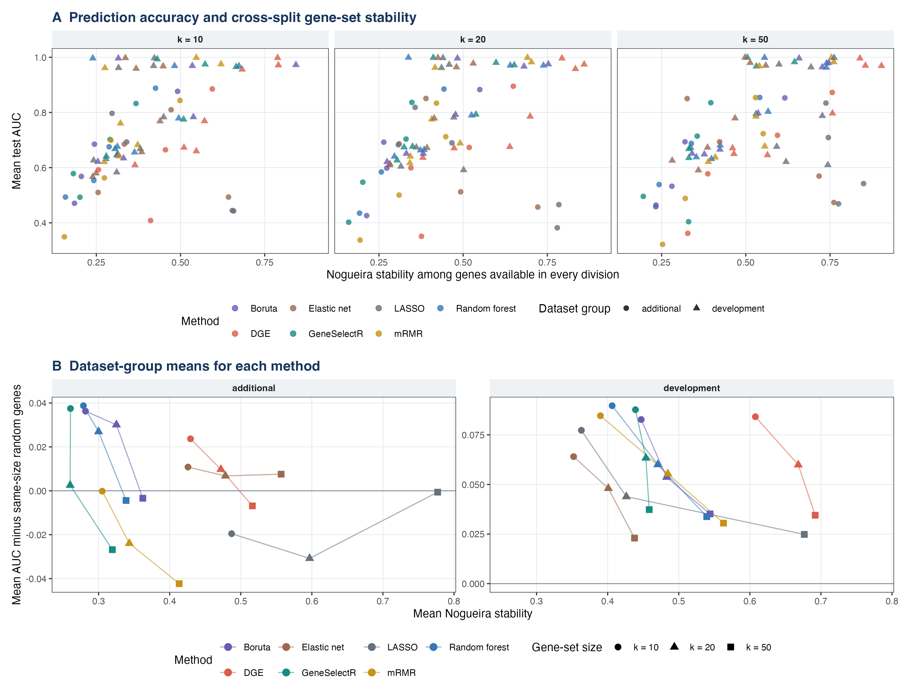
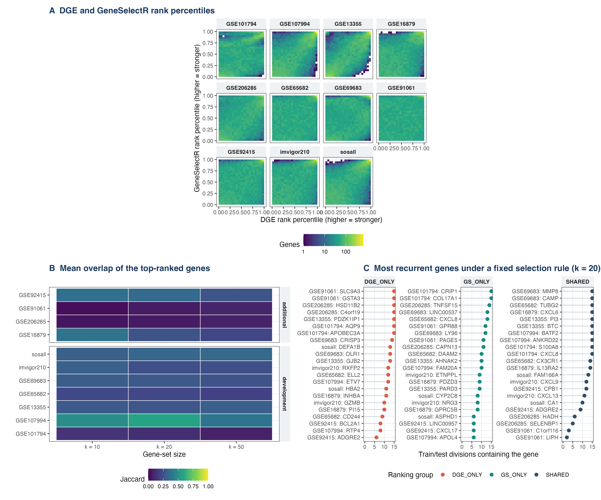
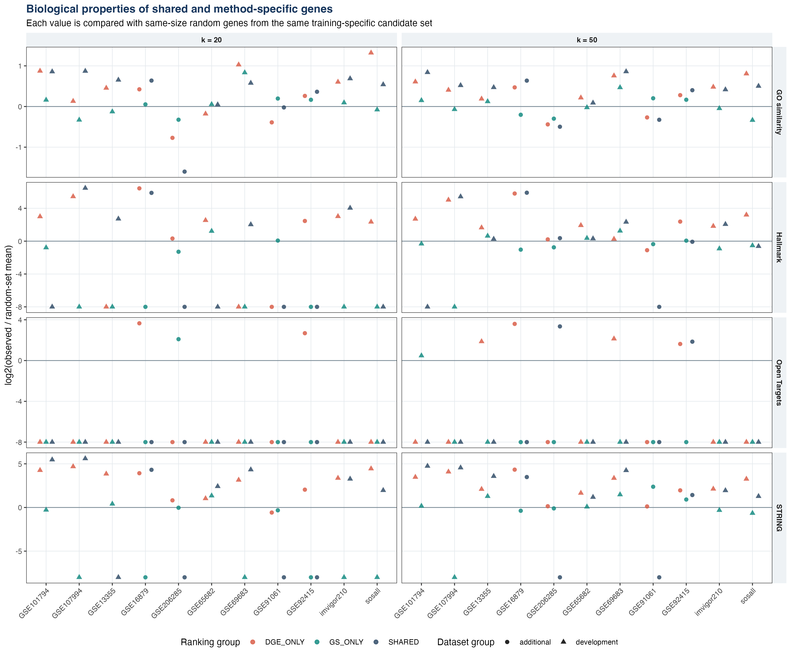

# GeneSelectR 2.0 — Benchmark

Reproducible benchmarking and supplementary-analysis scripts for
**GeneSelectR 2.0**, a gene-selection framework for transcriptomic
classification. The repository accompanies the GeneSelectR 2.0 manuscript and
records predictive benchmarking, configuration development, sensitivity
analyses, biological assessment, external validation, and figure generation.

Versioned result artifacts consist of rendered figures in PDF and PNG format.
Input data, generated CSV tables, fitted objects, caches, logs, and local
reports are excluded by [`.gitignore`](.gitignore). The scripts below recreate
these files in local ignored directories.

## Repository structure

```text
├── analysis/
│   ├── config.R                   # Dataset roles, seeds, package revision, and shared settings
│   ├── check_inputs.R             # Input and software checks
│   ├── check_repository_contents.sh
│   └── run_all.sh                 # Complete analysis entry point
├── benchmarks/                    # Dataset preparation and historical benchmark scripts
├── redesign/
│   ├── R/                         # Shared fitting, evaluation, and biological functions
│   ├── complementarity_analysis/  # Stability, DGE comparison, biology, and figures
│   ├── tests/                     # Analysis-code checks
│   └── run_*.R                    # Primary, ablation, sensitivity, and development analyses
├── supplementary/
│   ├── figures/                   # Committed PDF and PNG results
│   ├── methods/                   # Supplementary methods
│   ├── configurations/            # Configuration and analysis-status registry
│   ├── provenance/                # Revision and reproducibility records
│   └── scripts/                   # Reviewer-facing analysis entry points
├── data/                           # Local inputs; ignored by Git
├── .gitignore
└── README.md
```

## Analysis overview

### 1. Primary seven-dataset benchmark

The primary analysis uses SOS-ALL for method development and six validation
datasets: GSE101794, GSE107994, GSE13355, GSE65682, GSE69683, and IMvigor210.
The design uses three repeats of five stratified outer folds, training-specific
2,000-gene candidate pools, and panel sizes of 10, 20, 50, 100, 200, and 500
genes.

The comparison includes GeneSelectR configurations, differential-expression
ranking, random-forest importance, Boruta, mRMR, LASSO, elastic net, and the
recorded method-development variants. Predictive performance is evaluated as
test AUC and AUC minus a matched same-size Random reference.

### 2. Ablation and sensitivity analyses

The repository evaluates recurrence, SHAP contribution, mutual information,
score combinations, permutation adjustment, random-reference sampling,
training-based panel-size selection, and `glmnet` convergence. The established
outer splits and deterministic evaluator seeds are reused where the analysis
design requires saved-ranking reconstruction.

### 3. Biological assessment

GO semantic similarity, Hallmark shared membership, Open Targets disease
association, and STRING protein association are assessed after predictive
ranking. Each observed panel is compared with same-size random genes from the
corresponding training-specific candidate pool. Biological measurements remain
separate from the predictive score.

### 4. DGE and GeneSelectR complementarity

The numbered scripts in `redesign/complementarity_analysis/` compare DGE and
GeneSelectR rankings within the same saved training divisions. They calculate
rank correlations, top-k overlap, cross-split stability, recurrent genes, and
biological properties of shared and method-specific genes.

### 5. Follow-up analyses

GSE16879, GSE91061, GSE92415, and GSE206285 are retained as additional
follow-up datasets. Their outputs are separated from the primary seven-dataset
numerical summary. The committed figure set preserves the earlier 11-dataset
comparative layout.

## Requirements

The analysis requires R, the packages checked by `analysis/check_inputs.R`,
and the GeneSelectR package interface recorded in `analysis/config.R`. The
package bootstrap extracts the pinned package revision `621be0c1` into the
ignored `package/` directory.

The figure workflow requires `ggplot2` and `patchwork`. Dataset-specific
preparation and evaluation also use packages including `glmnet`, `xgboost`,
`ranger`, `randomForest`, `Boruta`, `mRMRe`, and Bioconductor data packages.

## Data setup

All inputs are stored under ignored paths. The input check reports each missing
file and package:

```bash
Rscript analysis/check_inputs.R
```

Expected inputs include:

- SOS-ALL expression and metadata at `data/normalized_logcpm.csv` and
  `data/metadata.csv`;
- prepared validation matrices and metadata under `data/GSE*/`;
- IMvigor210 through `easierData` or `data/IMvigor210.all.rds`;
- frozen GO, Hallmark, Open Targets, and STRING resources under local data or
  cache directories;
- saved rankings and train/test divisions for reconstruction analyses.

Public GEO preparation scripts are indexed in
[`benchmarks/README.md`](benchmarks/README.md). Study inputs and generated
matrices remain local.

## Running the analysis

Run commands from the repository root. The complete workflow can require many
hours.

```bash
# Extract the pinned GeneSelectR package source
bash analysis/bootstrap_package.sh

# Check inputs and software
Rscript analysis/check_inputs.R

# Run analysis-code checks
bash analysis/run_all.sh tests

# Run the complete recorded analysis
bash analysis/run_all.sh all
```

Individual scopes are available:

```bash
bash analysis/run_all.sh primary
bash analysis/run_all.sh ablations
bash analysis/run_all.sh biology
bash analysis/run_all.sh complementarity
bash analysis/run_all.sh exploratory
bash analysis/run_all.sh review
```

The default worker limit is two. Set `GENESELECTR_N_CORES` before execution to
change it. Set `GENESELECTR_CALL_BUDGET` to change the checkpoint budget used
by long-running analyses.

## Regenerating CSV result tables

CSV tables are generated during analysis and remain ignored by Git. The
complete command is:

```bash
bash analysis/run_all.sh all
```

Principal output locations are:

- `redesign/results_corrected/` for the primary benchmark, ablations,
  calibration, random-reference, panel-size, convergence, and biology tables;
- `redesign/results_frozen_external_exact_2026-08-31/` for the four follow-up
  datasets;
- `redesign/complementarity_analysis/results/` for stability, DGE agreement,
  gene-group biology, figure-source CSV files, and regenerated figures.

The complementarity tables and figures can be regenerated after the saved
benchmark outputs are available:

```bash
Rscript redesign/complementarity_analysis/01_gene_set_stability.R
Rscript redesign/complementarity_analysis/02_dge_geneselectr_concordance.R
Rscript redesign/complementarity_analysis/03_gene_group_characterization.R
Rscript redesign/complementarity_analysis/04_gene_group_biology.R
Rscript redesign/complementarity_analysis/06_make_figures.R
```

The last command reads the generated CSV tables and writes the figure-source
CSVs to `redesign/complementarity_analysis/results/figure_source_data/`.

## Results

Only rendered figures are committed as result artifacts. Numerical tables are
recreated with the commands above.

### Prediction and cross-split stability

[](supplementary/figures/Figure_2_prediction_and_stability.pdf)

### DGE and GeneSelectR complementarity

[](supplementary/figures/Figure_3_DGE_GeneSelectR_complementarity.pdf)

### Biological properties of shared and method-specific genes

[](supplementary/figures/Figure_4_gene_group_biology.pdf)

Additional stability and component figures are listed in the
[`supplementary/figures/` index](supplementary/figures/README.md).

## Supplementary documentation

- [Supplementary analysis index](supplementary/README.md)
- [Synthesized analysis report](supplementary/synthesized_report.md)
- [Numerical results summary](supplementary/results_summary.md)
- [Supplementary methods](supplementary/methods/README.md)
- [Configuration registry](supplementary/configurations/registry.md)
- [Figure manifest](supplementary/figures/manifest.md)
- [Provenance and reproducibility checklist](supplementary/provenance/README.md)

## Reproducibility

Analysis seeds, split construction, evaluator seeds, dataset roles, and worker
limits are recorded in the scripts and `analysis/config.R`. Generated outputs
remain local and preserve their configuration and provenance records within
the ignored result directories.

Run the tracked-file policy check before committing changes:

```bash
bash analysis/check_repository_contents.sh
```

## Citation

If these scripts or figures are used, cite the GeneSelectR 2.0 manuscript. The
complete manuscript reference will be added after publication.

## License

See [LICENSE](LICENSE).
